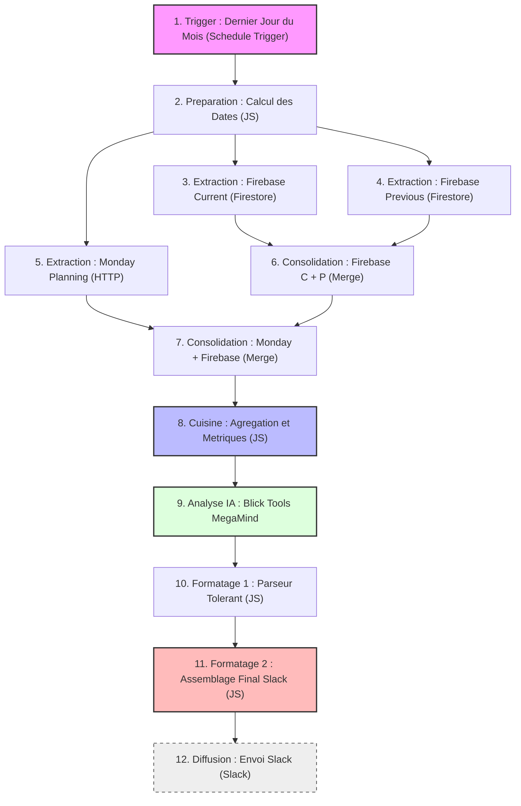

# 📘 Documentation Officielle : Rapport Auto vers Slack (Blick Tools MegaMind)

Ce document centralise et formalise la configuration complète du workflow **n8n** générant le rapport mensuel automatique pour la rédaction de **Blick**. Il a pour objectif de pérenniser la maintenance du système en explicitant le rôle de chaque nœud, sa configuration recommandée, et en fournissant le **code Javascript 100% complet, daté et non-tronqué**.

---

## 🗺️ Cartographie Visuelle du Workflow

Voici l'enchaînement logique complet des **12 nœuds** constituant le workflow, depuis le déclenchement jusqu'à la livraison finale sur Slack.



---

## 🛠️ Dictionnaire et Propriétés des Nœuds

Pour assurer une lisibilité optimale dans l'interface n8n, il est recommandé de renommer chaque nœud selon la nomenclature explicite ci-dessous.

| # | Nom Recommandé (n8n) | Type de Nœud | Configuration & Propriétés Clés | Rôle et Utilité |
| :--- | :--- | :--- | :--- | :--- |
| **1** | `Trigger : Dernier Jour du Mois` | **Schedule Trigger** | *Interval* : Quotidien à `09:00`. Bloqué en production par la condition temporelle du nœud suivant. | Déclenche le workflow chaque matin pour évaluer si c'est le moment de générer le rapport. |
| **2** | `Continues if last day of the month` | **Code (JavaScript)** | *Mode* : `Run Once for All Items`. Bloque l'exécution si on n'est pas le dernier jour du mois ( bypass `if (true)` actif en dév). | Filtre d'exécution temporel pour n'autoriser le rapport qu'à la fin de la période d'analyse. |
| **3** | `Calcul des Dates` | **Code (JavaScript)** | *Mode* : `Run Once for All Items`. Génère les bornes ISO et labels français (`current`, `previous`, `next`). | Fournit les dates absolues pour filtrer Firebase et Monday. |
| **4** | `Firebase Current` | **Firestore** | *Operation* : `Get All Documents`. *Collection* : `embeds`. Filtre par date du mois actuel via Structured Query. | Récupère tous les widgets créés durant le mois faisant l'objet du rapport. |
| **5** | `Firebase Previous` | **Firestore** | *Operation* : `Get All Documents`. *Collection* : `embeds`. Filtre par date du mois précédent. | Récupère l'historique complet nécessaire au calcul des évolutions (%). |
| **6** | `HTTP Request` | **HTTP Request** | *Method* : `POST`. *URL* : API Monday Graphql. Récupère le tableau des publications futures. | Extrait le planning éditorial du mois à venir pour les suggestions de l'IA. |
| **7** | `Merge` | **Merge** | *Mode* : `Append`. Joint les flux Firebase actuel et précédent. | Fusionne les deux listes de documents pour les transmettre en bloc. |
| **8** | `Merge Firebase + Monday` | **Merge** | *Mode* : `Append`. Joint le flux Monday avec les données Firebase consolidées. | Réunit l'intégralité des entrées externes avant l'étape de calcul. |
| **9** | `Cuisine` | **Code (JavaScript)** | *Mode* : `Run Once for All Items`. Contient le dictionnaire de traduction, les formule d'engagement et le moteur d'exclusion. | **Moteur de calcul du workflow**. Nettoie les données, calcule l'engagement, filtre les exclus et prépare le JSON de l'IA. |
| **10** | `Ask MacMini` | **Basic LLM Chain** | *Model* : OpenAI Model (pointant vers LM Studio Local `http://[IP]:1234/v1`). System + User Prompts. | Génère l'analyse qualitative et les suggestions de widgets par IA. |
| **11** | `Parser` | **Code (JavaScript)** | *Mode* : `Run Once for All Items`. Nettoyage Regex + Fallback Regex anti-crash. | Sécurise le JSON généré par l'IA en cas de guillemets doubles non échappés. |
| **12** | `Final report gen` | **Code (JavaScript)** | *Mode* : `Run Once for All Items`. Formate le Markdown final, applique le standard suisse `'` et gère les rubriques dynamiques. | Assemble le template de message Slack final en respectant la limite des 4 000 caractères. |
| **13** | `JSON to Slack msg` | **Slack** | *Authentication* : Slack OAuth. *Channel* : `#blick-tools-reports`. Actuellement désactivé. | Envoie le rapport rédigé sous forme de message unique dans le canal Slack cible. |

---

## 📜 Codes de Programmation 100% Complets

> [!WARNING]
> Ces scripts doivent être collés en remplacement intégral dans les blocs n8n correspondants. Veillez à ne modifier aucune fonction de formatage pour ne pas casser le calcul des évolutions ou le formatage suisse.

### 1. Nœud "2. Continues if last day of the month"
📅 **Dernière version : 29 mai 2026** *(Bypass actif en mode développement)*

```javascript
// =========================================================================
// NŒUD n8n : Continues if last day of the month
// DERNIÈRE MISE À JOUR : 29 mai 2026 (Intégration initiale)
// DESCRIPTION : Filtre d'exécution quotidien (bypass if (true) actif pour dév)
// =========================================================================

const now = new Date();
const tomorrow = new Date(now);
tomorrow.setDate(now.getDate() + 1);

// Si demain est le 1er du mois → aujourd'hui est le dernier jour
if (tomorrow.getDate() === 1) {
  return items; // on laisse passer les données
}

// Sinon, on bloque le workflow
return [];
```

---

### 2. Nœud "3. Calcul des Dates"
📅 **Dernière version : 29 mai 2026** *(Lissage du formatLabel français pour les trois périodes)*

```javascript
// =========================================================================
// NŒUD n8n : Calcul des Dates
// DERNIÈRE MISE À JOUR : 29 mai 2026 (Formatage des labels français et ISO ranges)
// DESCRIPTION : Génère les plages temporelles dynamiques courantes, passées et futures
// =========================================================================

const now = new Date();

// --- MOIS EN COURS ---
const currentMonthStart = new Date(now.getFullYear(), now.getMonth(), 1, 0, 0, 0);
const currentMonthEnd = new Date(now.getFullYear(), now.getMonth() + 1, 0, 23, 59, 59);

// --- MOIS PRÉCÉDENT ---
const prevMonthStart = new Date(now.getFullYear(), now.getMonth() - 1, 1, 0, 0, 0);
const prevMonthEnd = new Date(now.getFullYear(), now.getMonth(), 0, 23, 59, 59);

// --- MOIS PROCHAIN ---
const nextMonthStart = new Date(now.getFullYear(), now.getMonth() + 1, 1, 0, 0, 0);
const nextMonthEnd = new Date(now.getFullYear(), now.getMonth() + 2, 0, 23, 59, 59);

const formatLabel = (date) => date.toLocaleString('fr-FR', { month: 'long', year: 'numeric' });

return [{
  json: {
    current: {
      start: currentMonthStart.toISOString(),
      end: currentMonthEnd.toISOString(),
      label: formatLabel(currentMonthStart)
    },
    previous: {
      start: prevMonthStart.toISOString(),
      end: prevMonthEnd.toISOString(),
      label: formatLabel(prevMonthStart)
    },
    next: {
      start: nextMonthStart.toISOString(),
      end: nextMonthEnd.toISOString(),
      label: formatLabel(nextMonthStart)
    }
  }
}];
```

---

### 3. Nœud "9. Cuisine"
📅 **Dernière version : 29 mai 2026** *(Moteur d'exclusion exclusionRules & Liaison Firestore restaurés)*

```javascript
// =========================================================================
// NŒUD n8n : Cuisine
// DERNIÈRE MISE À JOUR : 29 mai 2026 (Fusion des logiques Firestore et exclusionRules)
// DESCRIPTION : Moteur d'agrégation, nettoyage et calculs d'engagement
// =========================================================================

// --- 1. RÉCUPÉRATION DES DONNÉES ---
const currentMonthDocs = $('Firebase Current').all();
const previousMonthDocs = $('Firebase Previous').all();
const dates = $('Calcul des Dates').first().json;
const mondayItems = $('HTTP Request').first().json.data.boards[0].items_page.items;

const MISSING = "<MISSING_FIELD>";

// --- 2. CONFIGURATION & MAPPING ---
const MONDAY_DATE_COL_ID = "timeline"; 
const MONDAY_STATUS_COL_ID = "status"; 

const typeFrMap = {
    poll: "Sondage", calendar: "Calendrier", teaser: "Teaser",
    folder: "Dossier", tinder: "Tinder", quiz: "Quiz",
    testimony: "Appel à témoignage", potm: "Joueur du match",
    prono: "Pronostic", facts: "Faits marquants"
};

// --- 3. UTILS & FORMATAGE ---
const cleanStr = (str) => {
    if (!str || str === MISSING) return "";
    return str.replace(/\r?\n|\\n/g, ' ').replace(/["\\]/g, '').replace(/\s\s+/g, ' ').trim();
};

const formatDateFr = (dateStr) => {
    if (!dateStr) return "";
    const d = new Date(dateStr);
    return isNaN(d.getTime()) ? "" : d.toLocaleDateString('fr-FR', { day: 'numeric', month: 'short', year: 'numeric' });
};

const calcEvol = (current, previous) => {
    if (previous === undefined || previous === null || previous === 0) return "N/A";
    const change = ((current - previous) / previous) * 100;
    return (change > 0 ? "+" : "") + change.toFixed(1) + "%";
};

// --- 4. LOGIQUES SPÉCIFIQUES FIREBASE (Titres & Calculs) ---
const titleGenerators = {
    poll: (d) => cleanStr(d.pollTxt) || "Sondage sans titre",
    calendar: (d) => cleanStr(d.calName) || "Calendrier sans titre",
    teaser: (d) => cleanStr(d.teaserTitle || d.title) || "Teaser sans titre",
    folder: (d) => cleanStr(d.folderName) || "Dossier sans titre",
    tinder: (d) => cleanStr(d.tinderTitle) || "Tinder sans titre",
    quiz: (d) => cleanStr(d.title) || "Quiz sans titre",
    testimony: (d) => cleanStr(d.title) || "Appel à témoignage",
    potm: (d) => d.context?.text ? `Joueur du match de ${cleanStr(d.context.text)}` : "Joueur du match",
    prono: (d) => d.pronoData?.item1?.name ? `Pronostic ${cleanStr(d.pronoData.item1.name)} - ${cleanStr(d.pronoData.item2?.name)}` : "Pronostic sportif",
    facts: (d) => d.factsData?.rencontre ? `Faits marquants de ${cleanStr(d.factsData.rencontre)}, ${formatDateFr(d.factsData.date || d.timeCreated)}` : "Faits marquants"
};

const calculators = {
    poll: (d) => (d.answerCounters || []).reduce((a, b) => a + Number(b || 0), 0),
    calendar: (d) => Number(d.counterSeeAllClicks || 0),
    teaser: (d) => Number(d.counterClicks || 0),
    folder: (d) => (d.buttons || []).reduce((acc, btn) => acc + Number(btn.buttonCounterClicks || 0), 0),
    tinder: (d) => Object.values(d.tinderVotes || {}).reduce((acc, curr) => acc + Number(curr.yes || 0) + Number(curr.no || 0), 0),
    quiz: (d) => Object.values(d.statsGlobal?.scoreDistribution || {}).reduce((a, b) => a + Number(b || 0), 0),
    testimony: (d) => Number(d.counterMsgSent || 0),
    potm: (d) => Number(d.totalVotes || 0),
    prono: (d) => Object.values(d.pronoData || {}).reduce((acc, curr) => acc + Number(curr.votes || 0), 0),
    facts: (d) => Number(d.counterReveal || 0) + Object.values(d.ratingStats || {}).reduce((a, b) => a + Number(b || 0), 0)
};

// --- 5. MOTEUR D'EXCLUSION ÉVOLUTIF (Tops / Flops) ---
const exclusionRules = [
    // Règle 1 : exclure les Faits marquants (facts) n'ayant aucune donnée interactive (ni number, ni rating)
    (w) => {
        if (w.type === 'facts') {
            if (w.factsData && Array.isArray(w.factsData.items)) {
                const hasInteractive = w.factsData.items.some(item => 
                    item.type === 'number' || item.type === 'rating'
                );
                return !hasInteractive;
            }
            return true; 
        }
        return false;
    }
    // [AJOUTER DE NOUVELLES RÈGLES ICI SANS IMPACT ÉDITORIAL GLOBAL]
];

// --- 6. TRAITEMENT FIREBASE ---
function processCollection(docs) {
    const active = docs.filter(d => d.json.deleted !== true);
    let totalEng = 0;
    const list = active.map(item => {
        const d = item.json;
        const type = d.type;
        const score = calculators[type] ? calculators[type](d) : 0;
        totalEng += score;
        
        // Évaluation de l'exclusion
        const shouldExclude = exclusionRules.some(rule => rule(d));
        
        // Calcul de la durée d'exposition en jours
        const createdDateStr = d.timeCreated || d.timeUpdated;
        let activeDays = 1;
        if (createdDateStr) {
            try {
                const createdDate = new Date(createdDateStr);
                const currentDate = new Date();
                const diffTime = Math.max(0, currentDate - createdDate);
                activeDays = Math.ceil(diffTime / (1000 * 60 * 60 * 24)) || 1;
            } catch (e) {
                activeDays = 1;
            }
        }

        return { 
            titre: titleGenerators[type] ? titleGenerators[type](d) : `Widget ${type}`, 
            type_technique: type, 
            type_fr: typeFrMap[type] || type,
            engagement: score,
            exclure_classement: shouldExclude,
            jours_actifs: activeDays,
            rubrique: d.theme || "Non catégorisé",
            date_creation: createdDateStr || "N/A"
        };
    }).sort((a,b) => b.engagement - a.engagement);

    return { volume: active.length, engagement: totalEng, full_list: list };
}

const current = processCollection(currentMonthDocs);
const previous = processCollection(previousMonthDocs);

// --- 7. TRAITEMENT MONDAY (Filtre mois prochain + Marques) ---
const nextMonthNum = new Date(dates.next.start).toISOString().split('-')[1];
const planningProchain = mondayItems
    .filter(item => {
        const timeVal = item.column_values.find(cv => cv.id === MONDAY_DATE_COL_ID)?.text;
        return timeVal && timeVal.includes(`-${nextMonthNum}-`);
    })
    .map(item => {
        let brand = "Général";
        const statusVal = item.column_values.find(cv => cv.id === MONDAY_STATUS_COL_ID)?.text || "";
        const groupTitle = item.group?.title || "";
        const ident = (statusVal + " " + groupTitle).toLowerCase();
        
        if (ident.includes("blick")) brand = "Blick";
        else if (ident.includes("pme")) brand = "PME";
        else if (ident.includes("illustr")) brand = "L'illustré";

        return { 
            theme: item.name, 
            marque: brand, 
            dates: item.column_values.find(cv => cv.id === MONDAY_DATE_COL_ID)?.text || "" 
        };
    });

// --- 8. OUTPUT FINAL EXPLICITE POUR L'IA ---
return [{
    json: {
        contexte_temporel: { 
            mois_actuel: dates.current.label,
            mois_precedent: dates.previous.label,
            mois_prochain: dates.next.label
        },
        bilan_comparatif_global: {
            engagement_total: {
                valeur_actuelle: current.engagement,
                valeur_precedente: previous.engagement,
                evolution: calcEvol(current.engagement, previous.engagement)
            },
            volume_production: {
                valeur_actuelle: current.volume,
                valeur_precedente: previous.volume,
                evolution: calcEvol(current.volume, previous.volume)
            }
        },
        donnees_detaillees_actuel: current.full_list,
        donnees_detaillees_precedent: previous.full_list,
        planning_editorial_futur: planningProchain,
        instructions_ia: {
            mission: "Analyser les performances média et rédiger un rapport structuré.",
            action_requise: `Compare l'intégralité de 'donnees_detaillees_actuel' avec 'donnees_detaillees_precedent'. Identifie les succès, les échecs et les tendances. Utilise 'planning_editorial_futur' pour annoncer les thèmes de ${dates.next.label} par marque.`
        }
    }
}];
```

---

### 4. Nœud "11. Parser"
📅 **Dernière version : 29 mai 2026** *(Ajout du parseur Regex tolérant de secours)*

```javascript
// =========================================================================
// NŒUD n8n : Parser
// DERNIÈRE MISE À JOUR : 29 mai 2026 (Fallback Regex anti-crash)
// DESCRIPTION : Parseur sécurisé de la chaîne JSON générée par l'IA
// =========================================================================

// On récupère le texte brut de l'IA
let rawText = $json.text || "";

// On retire les balises markdown si elles existent
let cleanedText = rawText
  .replace(/```json/g, '') // Enlève le début de balise
  .replace(/```/g, '')     // Enlève la fin de balise
  .trim();                 // Enlève les espaces/retours à la ligne inutiles

let parsedData = null;

try {
  // On tente de transformer le texte propre en objet JSON
  parsedData = JSON.parse(cleanedText);
} catch (error) {
  // Fallback de sécurité : parsing Regex si le JSON a des guillemets internes non échappés
  parsedData = {};
  
  // Extraction de l'analyse éditoriale
  const analyseRegex = /"analyse_editoriale"\s*:\s*"([\s\S]*?)"\s*,\s*"(?:propositions|propositions_mai)"/i;
  const matchAnalyse = cleanedText.match(analyseRegex);
  if (matchAnalyse) {
    parsedData.analyse_editoriale = matchAnalyse[1];
  } else {
    const analyseRegexSimple = /"analyse_editoriale"\s*:\s*"([\s\S]*?)"\s*$/i;
    const matchSimple = cleanedText.match(analyseRegexSimple);
    if (matchSimple) {
      parsedData.analyse_editoriale = matchSimple[1].replace(/\s*\}\s*$/, '');
    } else {
      parsedData.analyse_editoriale = "Erreur de formatage JSON. L'IA a généré des caractères incompatibles.";
    }
  }

  // Nettoyage des retours à la ligne
  if (parsedData.analyse_editoriale) {
    parsedData.analyse_editoriale = parsedData.analyse_editoriale
      .replace(/\\"/g, '"')
      .replace(/\\n/g, '\n');
  }

  // Extraction du tableau des propositions
  const propositionsRegex = /"(?:propositions|propositions_mai)"\s*:\s*(\[[\s\S]*?\])\s*\}/i;
  const matchPropositions = cleanedText.match(propositionsRegex);
  if (matchPropositions) {
    try {
      parsedData.propositions = JSON.parse(matchPropositions[1]);
    } catch (e2) {
      parsedData.propositions = [];
      const themeRegex = /\{\s*"theme"\s*:\s*"([\s\S]*?)"\s*,\s*"suggestions"\s*:\s*(\[[\s\S]*?\])\s*\}/gi;
      let themeMatch;
      while ((themeMatch = themeRegex.exec(matchPropositions[1])) !== null) {
        try {
          const theme = themeMatch[1];
          const suggestions = JSON.parse(themeMatch[2]);
          parsedData.propositions.push({ theme, suggestions });
        } catch (e3) {
          // Ignorer l'élément individuel corrompu
        }
      }
    }
  } else {
    parsedData.propositions = [];
  }
  
  parsedData.backup_parsed = true;
  parsedData.original_error = error.message;
}

// Sécurités finales sur les propriétés
if (!parsedData.analyse_editoriale) {
  parsedData.analyse_editoriale = "Analyse indisponible.";
}
if (!parsedData.propositions && parsedData.propositions_mai) {
  parsedData.propositions = parsedData.propositions_mai;
}
if (!Array.isArray(parsedData.propositions)) {
  parsedData.propositions = [];
}

return parsedData;
```

---

### 5. Nœud "12. Final report gen"
📅 **Dernière version : 29 mai 2026** *(Intégration du filtrage rankingWidgets & Standard suisse `'`)*

```javascript
// =========================================================================
// NŒUD n8n : Final report gen
// DERNIÈRE MISE À JOUR : 29 mai 2026 (Exclusion des widgets non-interactifs & séparateur suisse)
// DESCRIPTION : Assemblage du message Markdown et template de message Slack
// =========================================================================

const cuisine = $('Cuisine').first().json;
const megamind = $json;

const widgets = cuisine.donnees_detaillees_actuel;
const global = cuisine.bilan_comparatif_global;

// --- 1. DICTIONNAIRE DE TRADUCTION DES TYPES ---
const labelsFr = {
  poll: 'Sondage',
  quiz: 'Quiz',
  potm: 'Joueur du match',
  facts: 'Faits marquants',
  calendar: 'Calendrier',
  prono: 'Pronostic',
  tinder: 'Tinder',
  testimony: 'Appel à témoignage',
  folder: 'Dossier',
  teaser: 'Teaser'
};

// --- 2. CALCUL DU DÉTAIL DES TYPES (SECTION 1) ---
const typeCounts = {};
widgets.forEach(w => {
  const label = w.type_fr || "Inconnu";
  typeCounts[label] = (typeCounts[label] || 0) + 1;
});

const sortedTypes = Object.entries(typeCounts)
  .sort((a, b) => b[1] - a[1])
  .map(([type, count]) => {
    const pluriel = count > 1 && !type.toLowerCase().includes('faits marquants') ? 's' : '';
    return `${count} ${type.toLowerCase()}${pluriel}`;
  });

const detailTypes = `_( ${sortedTypes.join(', ')}... )_`;

// --- 3. CALCUL DE L'INDICE D'EFFICACITÉ ET SON ÉVOLUTION ---
const currIndex = global.engagement_total.valeur_actuelle / global.volume_production.valeur_actuelle;
const prevIndex = global.engagement_total.valeur_precedente / global.volume_production.valeur_precedente;

let evolIndexStr = "N/A";
if (prevIndex > 0) {
  const evolIndex = ((currIndex - prevIndex) / prevIndex) * 100;
  const signe = evolIndex >= 0 ? '+' : '';
  evolIndexStr = `${signe}${evolIndex.toFixed(1)}%`;
}

// --- 4. RÉPARTITION DYNAMIQUE PAR RUBRIQUE ET EVOLUTION (SECTION 2) ---
let rubriquesStats = {};

// Calcul mois en cours
widgets.forEach(w => {
  const r = w.rubrique || "Non catégorisé";
  if (!rubriquesStats[r]) rubriquesStats[r] = { current: 0, previous: 0 };
  rubriquesStats[r].current++;
});

// Calcul mois précédent
const widgetsPrev = cuisine.donnees_detaillees_precedent || [];
widgetsPrev.forEach(w => {
  const r = w.rubrique || "Non catégorisé";
  if (!rubriquesStats[r]) rubriquesStats[r] = { current: 0, previous: 0 };
  rubriquesStats[r].previous++;
});

const prevMonth = cuisine.contexte_temporel.mois_precedent;

// Fonction de calcul de l'évolution par rubrique
function getRubricEvol(current, previous, prevMonthLabel) {
  if (previous === 0 && current > 0) {
    return `(Nouveau vs ${prevMonthLabel})`;
  }
  if (current === 0 && previous > 0) {
    return `(Absent vs ${prevMonthLabel})`;
  }
  const evol = ((current - previous) / previous) * 100;
  const signe = evol >= 0 ? '+' : '';
  return `(${signe}${evol.toFixed(1)}% vs ${prevMonthLabel})`;
}

// Génération de la liste dynamique pour le rendu final
const repartitionRubriquesListe = Object.keys(rubriquesStats)
  .filter(r => rubriquesStats[r].current > 0 || rubriquesStats[r].previous > 0)
  .sort((a, b) => rubriquesStats[b].current - rubriquesStats[a].current)
  .map(r => {
    const current = rubriquesStats[r].current;
    const previous = rubriquesStats[r].previous;
    const evolStr = getRubricEvol(current, previous, prevMonth);
    const rCapitalized = r.charAt(0).toUpperCase() + r.slice(1);
    return `• *${rCapitalized}* : ${current} ${evolStr}`;
  })
  .join('\n');

// --- 5. TOPS ET FLOPS FILTRÉS (SECTION 3 - FILTRAGE DES NON-INTERACTIFS) ---
const rankingWidgets = widgets.filter(w => !w.exclure_classement);

const top1 = rankingWidgets[0] || { titre: "N/A", type_fr: "N/A", engagement: 0 };
const top2 = rankingWidgets[1] || { titre: "N/A", type_fr: "N/A", engagement: 0 };
const top3 = rankingWidgets[2] || { titre: "N/A", type_fr: "N/A", engagement: 0 };
const flop3 = rankingWidgets.slice(-3)[0] || { titre: "N/A", type_fr: "N/A", engagement: 0 };
const flop2 = rankingWidgets.slice(-2)[0] || { titre: "N/A", type_fr: "N/A", engagement: 0 };
const flop1 = rankingWidgets.slice(-1)[0] || { titre: "N/A", type_fr: "N/A", engagement: 0 };

function getActiveDays(w) {
  if (w.activeDays !== undefined) return w.activeDays;
  if (w.jours_actifs !== undefined) return w.jours_actifs;
  
  const creationDateStr = w.date_creation || w.timeCreated || w.created_at;
  if (!creationDateStr || creationDateStr === "N/A") {
    return 1;
  }
  
  try {
    const createdDate = new Date(creationDateStr);
    const currentDate = new Date();
    const diffTime = Math.max(0, currentDate - createdDate);
    const diffDays = Math.ceil(diffTime / (1000 * 60 * 60 * 24));
    return diffDays > 0 ? diffDays : 1;
  } catch (e) {
    return 1;
  }
}

// Standard de formatage suisse (apostrophe pour séparateur de milliers)
function formatInteractions(num) {
  if (num === undefined || num === null || isNaN(num)) return "0";
  return num.toString().replace(/\B(?=(\d{3})+(?!\d))/g, "'");
}

function getWidgetLine(w, isTop) {
  if (w.titre === "N/A") {
    return `• "N/A" (N/A) — 0 int.`;
  }
  const activeDays = getActiveDays(w);
  const interactionsStr = formatInteractions(w.engagement);
  const typeStr = w.type_fr || "Inconnu";
  
  if (isTop) {
    return `• "*${w.titre}*" (${typeStr}) — *${interactionsStr}* int. sur ${activeDays} j.`;
  } else {
    return `• "*${w.titre}*" (${typeStr}) — ${interactionsStr} int. sur ${activeDays} j.`;
  }
}

const top1Line = getWidgetLine(top1, true);
const top2Line = getWidgetLine(top2, true);
const top3Line = getWidgetLine(top3, true);
const flop3Line = getWidgetLine(flop3, false);
const flop2Line = getWidgetLine(flop2, false);
const flop1Line = getWidgetLine(flop1, false);

// --- 6. TRADUCTION DES SUGGESTIONS ET SÉCURITÉ ---
let propositionsArray = [];
for (const key in megamind) {
  if (key.startsWith('propositions')) {
    propositionsArray = megamind[key];
    break;
  }
}
if (!Array.isArray(propositionsArray)) {
  propositionsArray = [];
}

const suggestionsFormatees = propositionsArray.map(p => {
  const idees = p.suggestions.map(s => {
    let texte = s;
    Object.keys(labelsFr).forEach(key => {
      const regex = new RegExp(`^${key}\\s*:\\s*`, 'i');
      if (regex.test(texte)) {
        texte = texte.replace(regex, `${labelsFr[key]} : `);
      }
    });
    return `• ${texte}`; 
  });
  return `*${p.theme}*\n${idees.join('\n')}`; 
}).join('\n\n');

// --- 7. ASSEMBLAGE DU RAPPORT FINAL (VERSION COMPACTE & SUISSE) ---
const analyseTexte = megamind.analyse_editoriale || (megamind.rawText ? "Erreur de formatage JSON. Analyse brute irrécupérable." : "Analyse indisponible.");

const rapport = `*Rapport Blick Tools — ${cuisine.contexte_temporel.mois_actuel}*
Bilan du mois passé & opportunités pour *${cuisine.contexte_temporel.mois_prochain}*.


*📈 Instant T (Stats Globales)*

• *${formatInteractions(global.volume_production.valeur_actuelle)}* widgets créés (${global.volume_production.evolution} vs ${cuisine.contexte_temporel.mois_precedent})
${detailTypes}
• *${formatInteractions(global.engagement_total.valeur_actuelle)}* interactions (${global.engagement_total.evolution} vs ${cuisine.contexte_temporel.mois_precedent})
• *Efficacité : ${Math.round(currIndex)}* (${evolIndexStr} vs ${cuisine.contexte_temporel.mois_precedent})
_(Moyenne d'interactions/widget)_


*🗂️ Widgets par rubrique*

${repartitionRubriquesListe}


*🏆 Tops et flops de l'engagement*

*Le Top 3*
${top1Line}
${top2Line}
${top3Line}

*Le Flop 3*
${flop3Line}
${flop2Line}
${flop1Line}


*🤖 L'Analyse de Blick Tools MegaMind*

${analyseTexte}


*💡 Conseils Éditoriaux (Blick) — ${cuisine.contexte_temporel.mois_prochain}*

${suggestionsFormatees}
`;

return { rapport_final: rapport };
```

---

## 📈 Guide de Maintenance & Bonnes Pratiques

En cas d'évolution future ou d'incident sur le workflow, suivez ces règles de base :

### 1. Ajout de types de widgets
Si un nouveau type de widget (ex: `lifestyle_quiz`) est développé sur le backend, mettez simplement à jour :
* Le dictionnaire `typeFrMap` dans le nœud **Cuisine**.
* Le dictionnaire `labelsFr` dans le nœud **Final report gen**.

### 2. Ajout de règles d'exclusion
Si vous constatez que d'autres types de widgets détournés polluent les Tops/Flops, ajoutez une fonction anonyme de filtrage au tableau `exclusionRules` dans le nœud **Cuisine**. 
*Exemple :*
```javascript
(w) => {
    if (w.type === 'calendar' && w.estInformatiquePur === true) {
        return true;
    }
    return false;
}
```

### 3. Connexions Réseau
> [!IMPORTANT]
> Si l'IA n'arrive plus à répondre, vérifiez que LM Studio tourne sur le Mac Mini local et que l'accès réseau ("Allow Network Access") y est bien activé. Le NAS hébergeant n8n effectue un appel direct via l'IP privée.
