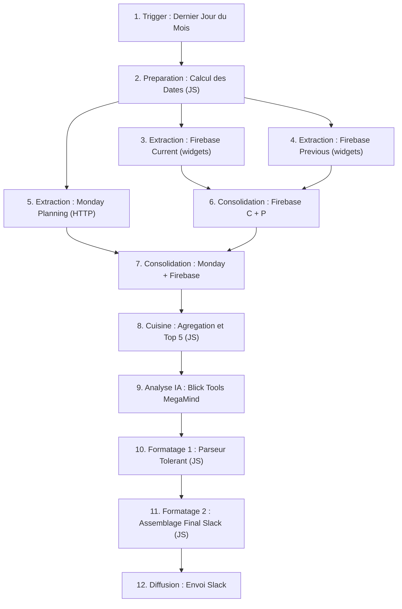

# 📘 Documentation Officielle : Rapport Auto vers Slack (Blick Tools MegaMind) - REFACTORISÉ

Ce document centralise la configuration complète du workflow **n8n** générant le rapport mensuel automatique.
Cette version a été mise à jour suite à la refactorisation de la base de données (migration vers la collection `widgets`).

---

## 🗺️ Cartographie Visuelle du Workflow

Voici l'enchaînement logique des nœuds, grandement simplifié grâce à la nouvelle architecture homogène de `widgets` et au nouveau format de rapport :



---

## 🛠️ Modifications par rapport au système "Legacy"

1. **Firebase Nodes** : 
   - Vous devez désormais pointer l'opération `Get All Documents` sur la collection **`widgets`** (au lieu de `embeds`).
2. **Nœud d'IA (Ask MacMini)** :
   - Le prompt système a été grandement réduit (voir fichier `system_prompt_megamind.md`).
   - L'IA ne génère plus de propositions de widgets. Elle produit uniquement l'analyse textuelle (`analyse_editoriale`) sur le Top 5.
3. **Optimisation "Cuisine" & Slack** :
   - Le code complexe de mapping des titres et des compteurs est supprimé. Tout widget a son titre dans `doc.meta.title` et son engagement dans `doc.stats.views` (ou `doc.stats.votes` selon le type).

---

## 📜 Codes de Programmation 100% Complets

<br><br>

━━━━━━━━━━━━━━━━━━━━━━━━━━━━━━━━━━━━━━━━━━━━━━━━━━━━━━━━━━━━━━━━━━━━
**✂️ COPIER-COLLER : Nœud 1 (Calcul des Dates)**
━━━━━━━━━━━━━━━━━━━━━━━━━━━━━━━━━━━━━━━━━━━━━━━━━━━━━━━━━━━━━━━━━━━━

### 1. Nœud "3. Calcul des Dates" (Inchangé)
Ce code peut rester le même que l'ancien. Il génère les bornes ISO (`current`, `previous`, `next`).

<br><br>

━━━━━━━━━━━━━━━━━━━━━━━━━━━━━━━━━━━━━━━━━━━━━━━━━━━━━━━━━━━━━━━━━━━━
**✂️ COPIER-COLLER : Nœud 2 (Cuisine)**
━━━━━━━━━━━━━━━━━━━━━━━━━━━━━━━━━━━━━━━━━━━━━━━━━━━━━━━━━━━━━━━━━━━━

### 2. Nœud "8. Cuisine" (Grandement Simplifié !)
Ce code récupère les données de Firebase et Monday, et prépare le Top 5.

```javascript
// =========================================================================
// NŒUD n8n : Cuisine (Version Refactorisée)
// DESCRIPTION : Moteur d'agrégation, calculs d'engagement (Top 5)
// =========================================================================

// --- 1. RÉCUPÉRATION ROBUSTE DES DONNÉES ---
const dates = $('Calcul des Dates').first().json;
const mondayItems = $('HTTP Request').first().json.data?.boards?.[0]?.items_page?.items || [];

let currentMonthDocs = [];
let previousMonthDocs = [];

// On essaie de récupérer depuis les nœuds nommés spécifiquement
try {
    const fc = $('Firebase Current').all();
    if (fc && fc.length > 0) currentMonthDocs = fc;
} catch(e) {}

try {
    const fp = $('Firebase Previous').all();
    if (fp && fp.length > 0) previousMonthDocs = fp;
} catch(e) {}

// Fallback : Si les nœuds ont été renommés, on trie depuis le flux entrant global
if (currentMonthDocs.length === 0 && previousMonthDocs.length === 0) {
    const currentStart = new Date(dates.current.start);
    const previousStart = new Date(dates.previous.start);
    
    $input.all().forEach(item => {
        const timeStr = item.json?.meta?.timeCreated;
        if (timeStr) {
            const t = new Date(timeStr);
            if (t >= currentStart) currentMonthDocs.push(item);
            else if (t >= previousStart && t < currentStart) previousMonthDocs.push(item);
        }
    });
}

// --- 2. CALCUL DES INTERACTIONS SELON LE TYPE ---
function calculateEngagement(doc) {
    if (!doc || !doc.stats) return 0;
    const stats = doc.stats;
    let eng = 0;

    switch (doc.type) {
        case 'testimony':
            eng = Number(stats.msgSent || 0);
            break;
        case 'teaser':
            eng = Number(stats.clicks || 0);
            break;
        case 'prono':
            if (stats.itemVotes) Object.values(stats.itemVotes).forEach(v => eng += Number(v || 0));
            break;
        case 'facts':
            eng += Number(stats.reveal || 0);
            if (stats.ratingStats) Object.values(stats.ratingStats).forEach(v => eng += Number(v || 0));
            break;
        case 'folder':
            if (stats.buttonClicks) Object.values(stats.buttonClicks).forEach(v => eng += Number(v || 0));
            break;
        case 'tinder':
            if (stats.tinderVotes) {
                Object.values(stats.tinderVotes).forEach(vote => {
                    eng += Number(vote?.yes || 0) + Number(vote?.no || 0);
                });
            }
            break;
        case 'poll':
            if (stats.answerCounters) Object.values(stats.answerCounters).forEach(v => eng += Number(v || 0));
            break;
        case 'potm':
            if (stats.playersVotes) Object.values(stats.playersVotes).forEach(v => eng += Number(v || 0));
            break;
        case 'quiz':
            if (stats.statsGlobal?.scoreDistribution) {
                Object.values(stats.statsGlobal.scoreDistribution).forEach(v => eng += Number(v || 0));
            }
            break;
        case 'calendar':
        default:
            eng = 0;
            break;
    }
    return eng;
}

// --- 3. TRAITEMENT DES WIDGETS ---
const typeFrMap = {
    poll: "Sondage", calendar: "Calendrier", teaser: "Teaser",
    folder: "Dossier", tinder: "Tinder", quiz: "Quiz",
    testimony: "Appel à témoignage", potm: "Joueur du match",
    prono: "Pronostic", facts: "Faits marquants"
};

let processedDocs = [];
let totalIntActuel = 0;
let totalIntPrevious = 0;

currentMonthDocs.forEach(item => {
    const doc = item.json;
    if (doc.meta?.deleted === true) return;

    const engagement = calculateEngagement(doc);
    totalIntActuel += engagement;

    processedDocs.push({
        titre: doc.meta?.title || "Widget sans titre",
        type: typeFrMap[doc.type] || doc.type || "Inconnu",
        theme: doc.meta?.theme || doc.theme || "Non catégorisé",
        engagement: engagement,
        dureeJours: 1 
    });
});

previousMonthDocs.forEach(item => {
    const doc = item.json;
    if (doc.meta?.deleted === true) return;
    totalIntPrevious += calculateEngagement(doc);
});

// --- 4. CALCUL DES MÉTRIQUES GLOBALES ---
function calcEvol(actuel, precedent) {
    if (precedent === 0) {
        if (actuel === 0) return "+0.0%";
        return "+100.0%"; // Convention d'augmentation depuis 0
    }
    const ratio = ((actuel - precedent) / precedent) * 100;
    return (ratio > 0 ? "+" : "") + ratio.toFixed(1) + "%";
}

let previousDocsValids = 0;
let themesCountPrev = {};

previousMonthDocs.forEach(item => {
    const doc = item.json;
    if (doc.meta?.deleted === true) return;
    previousDocsValids++;
    
    const theme = doc.meta?.theme || doc.theme || "Non catégorisé";
    themesCountPrev[theme] = (themesCountPrev[theme] || 0) + 1;
});

const currentDocsCount = processedDocs.length;
const evolWidgets = calcEvol(currentDocsCount, previousDocsValids);
const evolInt = calcEvol(totalIntActuel, totalIntPrevious);

const efficacite = currentDocsCount > 0 ? Math.round(totalIntActuel / currentDocsCount) : 0;
const efficacitePrev = previousDocsValids > 0 ? Math.round(totalIntPrevious / previousDocsValids) : 0;
const evolEff = calcEvol(efficacite, efficacitePrev);

// Détail des types de widgets
let typesCount = {};
processedDocs.forEach(doc => {
    typesCount[doc.type] = (typesCount[doc.type] || 0) + 1;
});
const typesDetailStr = Object.entries(typesCount)
    .sort((a, b) => b[1] - a[1])
    .map(([type, count]) => `${count} ${type.toLowerCase()}${count > 1 && !type.endsWith('s') && !type.endsWith('x') && !type.endsWith('z') ? 's' : ''}`)
    .join(', ');

// Agrégation par thème avec évolution
let themesCount = {};
processedDocs.forEach(doc => {
    themesCount[doc.theme] = (themesCount[doc.theme] || 0) + 1;
});

let themesEvolution = {};
for (const [theme, count] of Object.entries(themesCount)) {
    const prevCount = themesCountPrev[theme] || 0;
    themesEvolution[theme] = { count: count, prevCount: prevCount, evol: calcEvol(count, prevCount) };
}

// --- 5. EXTRACTION DES ÉVÉNEMENTS MONDAY ---
const nextMonthYear = new Date(dates.next.start).toISOString().split('-')[0];
const nextMonthNum = new Date(dates.next.start).toISOString().split('-')[1];
const targetDateStr = `${nextMonthYear}-${nextMonthNum}-`; // ex: "2026-08-"
const MONDAY_DATE_COL_ID = "timeline"; 
const MONDAY_STATUS_COL_ID = "status";

const evenementsMondayData = mondayItems
    .filter(item => {
        const timeVal = item.column_values?.find(cv => cv.id === MONDAY_DATE_COL_ID)?.text;
        if (!timeVal || !timeVal.includes(targetDateStr)) return false;
        
        const statusVal = item.column_values?.find(cv => cv.id === MONDAY_STATUS_COL_ID)?.text || "";
        const groupTitle = item.group?.title || "";
        const ident = (statusVal + " " + groupTitle).toLowerCase();
        
        if (ident.includes("pme") || ident.includes("illustr")) return false;
        
        return true;
    })
    .map(item => {
        const timeVal = item.column_values?.find(cv => cv.id === MONDAY_DATE_COL_ID)?.text;
        const startDate = timeVal ? timeVal.split(" - ")[0] : "9999-12-31";
        
        // Formatage de la date en français clair
        let dateAffichage = `(${timeVal})`;
        if (timeVal) {
            const parts = timeVal.split(" - ");
            const moisFr = ["janvier", "février", "mars", "avril", "mai", "juin", "juillet", "août", "septembre", "octobre", "novembre", "décembre"];
            const d1 = parts[0].split("-");
            if (d1.length === 3) {
                const j1 = parseInt(d1[2], 10);
                const m1 = moisFr[parseInt(d1[1], 10) - 1];
                const jour1Str = j1 === 1 ? "1er" : j1;
                
                if (parts.length === 2 && parts[0] !== parts[1]) {
                    const d2 = parts[1].split("-");
                    const j2 = parseInt(d2[2], 10);
                    const m2 = moisFr[parseInt(d2[1], 10) - 1];
                    const jour2Str = j2 === 1 ? "1er" : j2;
                    
                    if (m1 === m2) {
                        dateAffichage = `(du ${jour1Str} au ${jour2Str} ${m1})`;
                    } else {
                        dateAffichage = `(du ${jour1Str} ${m1} au ${jour2Str} ${m2})`;
                    }
                } else {
                    dateAffichage = `(${jour1Str} ${m1})`;
                }
            }
        }
        
        return {
            name: item.name,
            startDate: startDate,
            formattedDate: dateAffichage
        };
    });

// Tri chronologique
evenementsMondayData.sort((a, b) => a.startDate.localeCompare(b.startDate));

const evenementsMonday = evenementsMondayData.map(e => `${e.name} ${e.formattedDate}`);

// --- 6. GÉNÉRATION DU TOP 5 ---
processedDocs.sort((a, b) => b.engagement - a.engagement);
const top5 = processedDocs.slice(0, 5);

return [{
    json: {
        contexte_temporel: {
            mois_actuel: dates.current.label,
            mois_precedent: dates.previous.label,
            mois_prochain: dates.next.label
        },
        bilan_comparatif_global: {
            widgets_crees: { total: processedDocs.length, evolution: evolWidgets, details: typesDetailStr },
            engagement_total: { total: totalIntActuel, evolution: evolInt },
            efficacite: { total: efficacite, evolution: evolEff }
        },
        themes_evolution: themesEvolution,
        donnees_detaillees_actuel: top5,
        evenements_monday: evenementsMonday
    }
}];
```

<br><br>

━━━━━━━━━━━━━━━━━━━━━━━━━━━━━━━━━━━━━━━━━━━━━━━━━━━━━━━━━━━━━━━━━━━━
**✂️ COPIER-COLLER : Nœud 3 (Parser)**
━━━━━━━━━━━━━━━━━━━━━━━━━━━━━━━━━━━━━━━━━━━━━━━━━━━━━━━━━━━━━━━━━━━━

### 3. Nœud "10. Parser"
Idem que l'ancien, nettoie juste le JSON de l'IA (enleve les ```json).

```javascript
let jsonStr = $input.item.json.text || $input.item.json.message?.content || "{}";
jsonStr = jsonStr.replace(/```json/g, "").replace(/```/g, "").trim();

let parsedData = null;

try {
  parsedData = JSON.parse(jsonStr);
} catch (error) {
  // Fallback si le JSON est corrompu
  parsedData = {};
  const analyseRegex = /"analyse_editoriale"\s*:\s*"([\s\S]*?)"\s*\}?\s*$/i;
  const matchAnalyse = jsonStr.match(analyseRegex);
  
  if (matchAnalyse) {
    parsedData.analyse_editoriale = matchAnalyse[1].replace(/\\"/g, '"').replace(/\\n/g, '\n');
  } else {
    parsedData.analyse_editoriale = "Erreur d'analyse IA : Le texte n'a pas pu être lu.";
  }
}

return { json: { result: parsedData } };
```

<br><br>

━━━━━━━━━━━━━━━━━━━━━━━━━━━━━━━━━━━━━━━━━━━━━━━━━━━━━━━━━━━━━━━━━━━━
**✂️ COPIER-COLLER : Nœud 4 (Final report gen)**
━━━━━━━━━━━━━━━━━━━━━━━━━━━━━━━━━━━━━━━━━━━━━━━━━━━━━━━━━━━━━━━━━━━━

### 4. Nœud "11. Final report gen" (Assemblage Slack)
Assemble le Markdown cible pour Slack.

```javascript
const cuisine = $('Cuisine').first().json;
const iaResult = $('Parser').first().json.result;

const moisActuel = cuisine.contexte_temporel.mois_actuel;
const moisProcedent = cuisine.contexte_temporel.mois_precedent;
const moisProchain = cuisine.contexte_temporel.mois_prochain;
const stats = cuisine.bilan_comparatif_global;

const formatNumber = (num) => num.toString().replace(/\B(?=(\d{3})+(?!\d))/g, "'");

let markdown = `*Rapport Blick Tools — ${moisActuel}*
Bilan du mois passé & opportunités pour *${moisProchain}*.


*📈 Instant T (Stats Globales)*

• *${stats.widgets_crees.total}* widgets créés (${stats.widgets_crees.evolution} vs ${moisProcedent})
_( ${stats.widgets_crees.details} )_
• *${formatNumber(stats.engagement_total.total)}* interactions (${stats.engagement_total.evolution} vs ${moisProcedent})
• *Efficacité : ${formatNumber(stats.efficacite.total)}* (${stats.efficacite.evolution} vs ${moisProcedent})
_(Moyenne d'interactions/widget)_


*🗂️ Widgets par rubrique*

`;

for (const [theme, data] of Object.entries(cuisine.themes_evolution)) {
    if (data.prevCount === 0) {
        markdown += `• *${theme}* : ${data.count} (aucun widget en ${moisProcedent})\n`;
    } else {
        markdown += `• *${theme}* : ${data.count} (${data.evol} vs ${moisProcedent})\n`;
    }
}

markdown += `\n\n*🏆 Le Top 5 de l'engagement*\n\n`;

const top5 = cuisine.donnees_detaillees_actuel;
top5.forEach(item => {
    markdown += `• "*${item.titre}*" (${item.type}) — *${formatNumber(item.engagement)}* int. sur ${item.dureeJours} j.\n`;
});

markdown += `\n\n*🤖 L'Analyse de Blick Tools MegaMind*\n\n`;
markdown += `${iaResult.analyse_editoriale}\n`;

markdown += `\n\n*💡 Calendrier evergreen de ${moisProchain} (Blick)*\n\n`;
cuisine.evenements_monday.forEach(event => {
    markdown += `• ${event}\n`;
});

return {
    json: {
        text: markdown,
        blocks: [
            {
                type: "section",
                text: { type: "mrkdwn", text: markdown }
            }
        ]
    }
};
```
